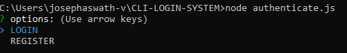
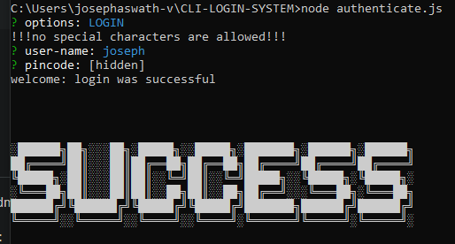
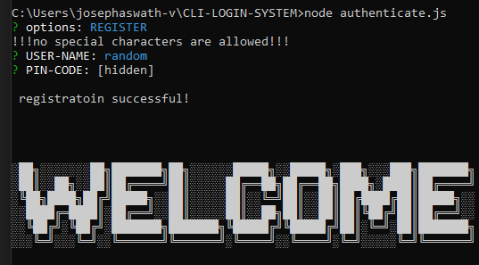

# CLI-LOGIN-SYSTEM
a node.js &amp; inquirer module based login system that uses JSON for storing user information 

snap shots of the project will give you an accurate idea of what this is about 

